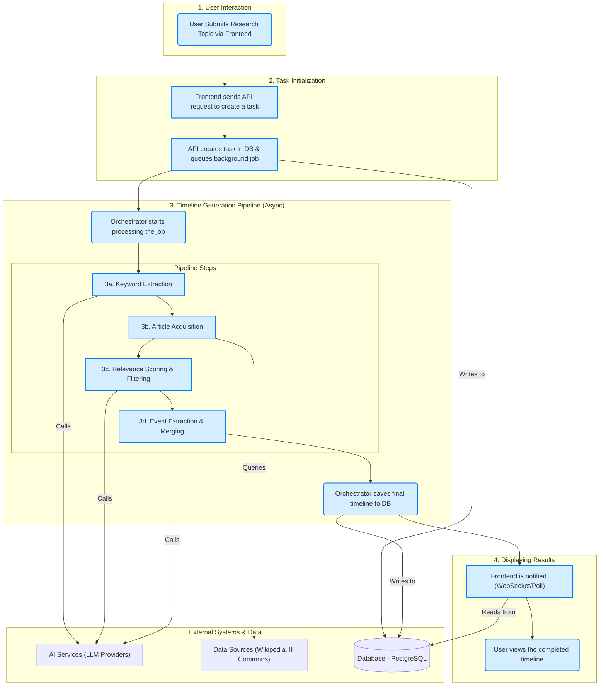

# Contributing to Common Chronicle

Thank you for your interest in contributing to Common Chronicle! This document provides guidelines for contributors to ensure consistency and quality across the codebase.

## 📋 Table of Contents

- [Project Overview](#project-overview)
- [System Architecture](#system-architecture)
- [Development Environment Setup](#development-environment-setup)
- [Code Standards](#code-standards)
- [Documentation Standards](#documentation-standards)
- [Contribution Process](#contribution-process)
- [Testing Requirements](#testing-requirements)
- [Commit Guidelines](#commit-guidelines)

## 🎯 Project Overview

Common Chronicle is an AI-powered historical research tool that transforms manual research into automated timeline generation. The project consists of:

- **Backend**: FastAPI-based Python application with PostgreSQL database
- **Frontend**: React + TypeScript with Vite build system
- **AI Integration**: Multiple LLM providers (OpenAI, Gemini, Ollama)
- **Data Sources**: Wikipedia, Wikinews, and custom datasets

## 🏛️ System Architecture

The following diagram illustrates the high-level architecture of the system, showing the flow from user request to timeline generation.



**Architectural Notes:**
This project utilizes a **hybrid task processing model** that combines WebSocket communication with database polling for a balance of real-time feedback and reliability.
- **Task Trigger**: Instead of a traditional message queue (like Celery or RQ), background processing for a pending task is initiated directly by a WebSocket connection from the client (`/ws/timeline/from_task/{task_id}`). This simplifies deployment by avoiding a separate worker process.
- **Real-time Progress**: The `Orchestrator` pushes live progress updates back to the client through this same WebSocket.
- **Reliability**: The WebSocket connection also polls the database for the task's final status (`completed` or `failed`). This ensures that even if the connection is interrupted and re-established, the user will still receive the final result once it's available in the database, providing a robust fault-tolerance mechanism.

## 🛠️ Development Environment Setup

### Prerequisites
- Python 3.12
- Node.js 18+
- PostgreSQL 12+
- Git

### Backend Setup
```bash
# Clone the repository
git clone https://github.com/Intelligent-Internet/Common_Chronicle.git
cd Common_Chronicle

# Set up Python environment
python -m venv .venv
source .venv/bin/activate
# Or on Windows: .venv\Scripts\activate

# Install dependencies
pip install -r requirements.txt
pip install -r requirements_dev.txt

# Set up environment variables
cp config.env.example .env
# Edit .env with your database URL and API keys

# Initialize your local database
# As this project doesn't ship with shared migrations, you need to create an initial one.
# Make sure your database is created, then run:
alembic revision --autogenerate -m "Init local database"
```

Add new line to your first alembic version file:

```bash
import pgvector.sqlalchemy
```

Then you can continue:
```bash
alembic upgrade head

# Set up pre-commit hooks
python scripts/setup-pre-commit.py
# Or on Windows: scripts\setup-pre-commit.bat

# Start the backend server
python main.py
```

### Frontend Setup
```bash
# Navigate to frontend directory
cd frontend

# Install dependencies
npm install

# Start the development server
npm run dev
```

### Core Data Source Setup (II-Commons)

To enable the powerful local search feature against a full English Wikipedia dataset, you need to run a local vector database instance provided by the [II-Commons](https://github.com/Intelligent-Internet/II-Commons) project. This is optional for general development but required for working on features related to local article acquisition.

**1. Download Prebuilt Dataset**

First, download the prebuilt "Wikipedia English" dataset from the II-Commons project. Please refer to their repository for the specific download links (often hosted on platforms like Hugging Face). Let's assume you've downloaded and extracted it to a local path like `D:\datasets\wikipedia_en`.

**2. Run the Database with Docker**

Use the following command to run a PostgreSQL container that serves the dataset. Make sure to replace the volume path with the actual path to your downloaded dataset.

```bash
# Note for Windows users: You might need to adjust the volume path format.
# For example: -v D:/datasets/wikipedia_en:/var/lib/postgresql/data
sudo docker run --rm -it \
  --name postgres-localvector \
  -e POSTGRES_USER=postgres \
  -e POSTGRES_PASSWORD=postgres.1234 \
  -e POSTGRES_DB=localvector \
  -e PGDATA=/var/lib/postgresql/data/basebackup \
  -v /path/to/your/downloaded/wikipedia_en:/var/lib/postgresql/data \
  -p 5432:5432 \
  postgres-17-parade-vchord
```

**3. Finalize Database Setup**

Once the container is running, connect to it using a `psql` client and run the following commands to optimize it for queries.

```sql
-- Connect to the local vector database, for example:
-- psql -h localhost -p 5432 -U postgres -d localvector
-- (The password is "postgres.1234")

-- Inside psql:
ALTER SYSTEM SET vchordrq.probes = 100;
```

After running `ALTER SYSTEM`, you must **restart the Docker container** for the change to take effect.

Your local Wikipedia data source is now ready! Ensure your `.env` file's `DATABASE_URL` points to this local database instance to use it.

## 📝 Code Standards

### Python Code Standards
- **Follow PEP 8** for code style
- **Use type hints** for all function parameters and return values
- **Import organization**: Use `isort` and `black` for formatting
- **Line length**: Maximum 88 characters (Black default)
- **Naming conventions**: `snake_case` for functions/variables, `PascalCase` for classes, `UPPER_CASE` for constants

### TypeScript Code Standards
- **Use TypeScript strict mode**
- **Follow ESLint configuration**
- **Prefer interfaces over types** for object shapes
- **Use meaningful names** for variables and functions
- **Organize imports**: External libraries first, then internal modules

### General Guidelines
- Write self-documenting code with clear names
- Keep functions small and focused on single responsibilities
- Use consistent error handling patterns
- Add logging for debugging and monitoring
- Write tests for critical functionality

## 🔧 Pre-commit Hooks

Pre-commit hooks automatically enforce code quality and consistency before each commit.

### Setup
```bash
# First, copy the OS-specific configuration file
# On Linux/macOS:
cp .pre-commit-config.yaml.linux .pre-commit-config.yaml
# On Windows:
copy .pre-commit-config.yaml.windows .pre-commit-config.yaml

# Automatic setup
python scripts/setup-pre-commit.py

# Manual verification
pre-commit run --all-files
```

### What Gets Checked
- **Code Formatting**: `black`, `isort`, `autoflake` (Python) + `ESLint` (TypeScript)
- **Code Quality**: `ruff` (Python linting) + `mypy` (type checking)
- **File Standards**: Whitespace, newlines, YAML validation, large file detection

### Common Commands
```bash
# Run all hooks manually
pre-commit run --all-files

# Skip hooks in emergency (use sparingly)
git commit --no-verify -m "Emergency fix"

# Fix most Python issues automatically
ruff --fix .
```

## 📚 Documentation Standards

### Core Principles
1. **Minimalist Approach** - Add comments only when necessary
2. **Business Logic Priority** - Explain "why" rather than "what"
3. **Type System Optimization** - Leverage type systems to avoid redundant documentation

### Documentation Layers

#### Module-Level (File Header)
```python
"""
[Module Name] for [primary purpose].

Architecture: [Show relationships with other components]
Key Features: [Brief list of main features]
"""
```

#### Class-Level
```python
class ClassName:
    """
    [Concise description].
    """
```

#### Function-Level (Complex Logic Only)
```python
# For complex business logic - explain the approach
async def calculate_relevance_score(event: TimelineEvent, viewpoint: str) -> float:
    """Calculate relevance using semantic similarity and temporal proximity."""
```

### Technical Debt Markers
- `FIXME:` Issues requiring urgent attention
- `TODO:` Planned improvements or refactoring
- `HACK:` Temporary workarounds with known limitations
- `PERF:` Performance optimization opportunities

## 🔄 Contribution Process

### For New Contributors
1. **Fork the repository** and create a feature branch
2. **Set up pre-commit hooks**: `python scripts/setup-pre-commit.py`
3. **Make your changes** following the coding standards
4. **Add tests** for new functionality
5. **Update documentation** as needed
6. **Commit your changes** (pre-commit hooks run automatically)
7. **Create a pull request** with a clear description

A great way to start is by looking for issues tagged with `good first issue` or `help wanted`. These are tasks that we've identified as good entry points into the project.

### Pull Request Guidelines
- Use descriptive titles that explain what the PR does
- Include a detailed description of changes made
- Reference related issues using GitHub's linking syntax
- Ensure all tests pass and documentation is updated
- Request reviews from relevant maintainers

## 🧪 Testing Requirements

### Python Testing
- Use `pytest` for unit and integration tests
- Maintain test coverage above 80%
- Include tests for error conditions and edge cases
- Use fixtures for common test data

### TypeScript Testing
- Use `Jest` and `React Testing Library` for frontend tests
- Test component behavior, not implementation details
- Include accessibility tests where applicable
- Mock external dependencies appropriately

## 📝 Commit Guidelines

Follow the [Conventional Commits](https://www.conventionalcommits.org/) specification:

```
<type>[optional scope]: <description>
```

### Types
- `feat`: New feature
- `fix`: Bug fix
- `docs`: Documentation changes
- `style`: Code style changes
- `refactor`: Code refactoring
- `test`: Adding or updating tests
- `chore`: Maintenance tasks

### Examples
```
feat(timeline): add event filtering by date range
fix(api): handle missing viewpoint_id in task creation
docs(readme): update installation instructions
```

## Submitting Issues
Before creating an issue, please check if a similar one already exists. We provide several issue templates to help you structure your report. Please use the appropriate template for bug reports, feature requests, or questions to ensure we have all the necessary information.

## 🚨 Quality Assurance

### Automated Checks (Pre-commit)
- Code formatting and linting
- Type checking
- File standards validation
- Security checks

### Manual Checks
- Test coverage >80%
- Performance validation
- Documentation quality
- Integration testing

## 📞 Getting Help

- **GitHub Issues**: For bug reports and feature requests
- **GitHub Discussions**: For general questions and discussions

## 📂 Configuration Files

| File | Purpose |
|------|---------|
| `.pre-commit-config.yaml` | Pre-commit hooks configuration |
| `pyproject.toml` | Python project configuration |
| `frontend/eslint.config.js` | Frontend linting rules |
| `config.env.example` | Environment variables template |

### Tool Migration Notes
**We've replaced pylint with ruff** for better performance and modern Python development.

## 📄 License

By contributing to Common Chronicle, you agree that your contributions will be licensed under the Apache License 2.0.

---

Thank you for contributing to Common Chronicle! Your efforts help make historical research more accessible to everyone. 🏛️✨
